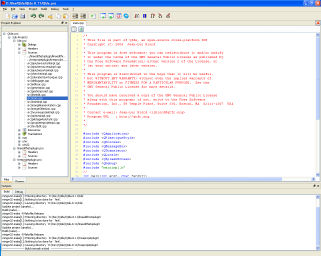

# QDevelop - A Development Environment for Qt4



This is github mirror of https://code.google.com/archive/p/qdevelop/ (see remarks bellow on migration).

**This is a dead project, ported to github just for historic value.**

QDevelop is a development environment entirely dedicated to Qt4. QDevelop requires Qt4, MinGW under Windows, gdb for programs debugging and ctags for code completion. QDevelop is available in English, French, German, Dutch and Russian.

Features at a glance:

* Cross Platform: Supports Linux, Windows 2000/XP/Vista
* Reading and writing project files (with some small restrictions)
* Add / Delete and edit project files (or external files)
* Management of normal projects and project SUBDIRS.
* Independent build for each projects. I.e. are rebuild only the really modified projects.
* In the event of errors or warnings of compilation, double-click on the line opens the corresponding editor.
* Debugging with gdb. Toggle breakpoints by click in the line number on editor or by right click. When the program is stopped on breakpoint, it's possible to view variables contents with a linedit.
* In the editor, F1 call Assistant to show help for the word under the cursor.
* In debugging mode, on a breakpoint, the macro pqstring makes it possible to show the contents of QString. That makes it possible to remove the `qDebug() << myString;` in the code.
* Open Source

Its Free!


## Notes
Code has been download from https://storage.googleapis.com/google-code-archive-source/v2/code.google.com/qdevelop/repo.svndump.gz (and available as download, just in case Google decides to finnally close google code). This was discussed here: https://stackoverflow.com/questions/39320990/google-code-archive-to-github.


The branch migration, was done doing instructions from: https://www.linkedin.com/pulse/migrating-from-svn-git-8-steps-preserving-history-giovanni-zito

The screen shot is from Wikipedia  - https://fr.wikipedia.org/wiki/QDevelop.

The authors file used was:

```
cucomania = Diego Iastrubni <diegoiast@gmail.com>
diegoiast = Diego Iastrubni <diegoiast@gmail.com>
diegoiast@gmail.com = Diego Iastrubni <diegoiast@gmail.com>
donaldinos = donaldinos <donaldinos>
jlbiord = jlbiord <jlbiord>
Lord.Divius = Lord.Divius <Lord.Divius>
ralfjung-e@gmx.de = ralfjung-e@gmx.de <ralfjung-e@gmx.de>
Trent.Zhou = Trent.Zhou <Trent.Zhou>
Author: (noauthor) = (noauthor) <(noauthor)>
(no author) = no_author <no_author@no_author>
```

If any of the original authors wants to fix commit with his email - please contact me, and I will rebase the repo.
